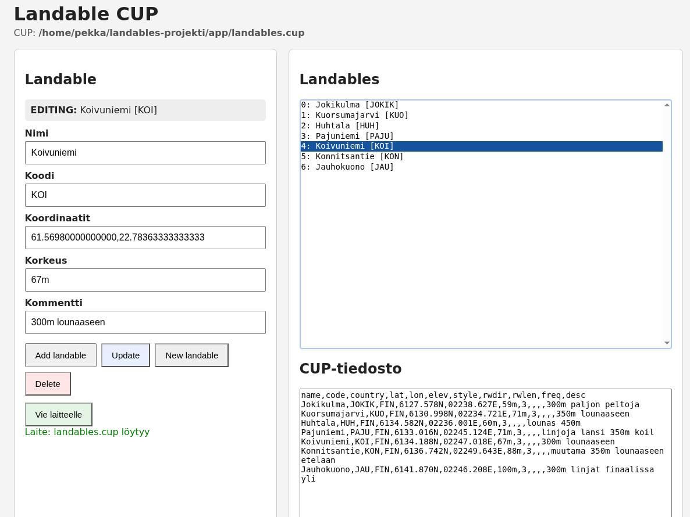

# Landable CUP

A small local web application for maintaining XCSoar `landables.cup`
files.

The application is intentionally simple:

- Python 3.10+ standard library only
- no Flask
- no database
- no JavaScript framework
- runs locally in a web browser
- the CUP file is the data store

It was originally made for maintaining personally checked glider
outlanding fields and transferring them to XCSoar on Android.

## Käyttöliittymä



## Features

- View the current CUP file in the browser
- Add a new landable
- Select an existing landable and edit it
- Update the selected landable
- Delete the selected landable with confirmation
- Clear the form with `New landable`
- Convert decimal GPS coordinates to CUP format
- Automatically use `FIN` as the country
- Automatically use CUP `style=3` for landables
- Create a `.bak` backup before changing the CUP file
- Optionally replace an existing `landables.cup` on an Android/XCSoar
  device mounted through Linux GVFS/MTP

## Requirements

Python 3.10 or newer.

No third-party packages are required.

Debian 13 works with the system Python 3.13.

## Quick start

```bash
python3 landable_web.py /home/you/landables.cup
```

Open:

```text
http://127.0.0.1:8765/
```

## Android / XCSoar

The Android device must already be mounted through Linux GVFS/MTP.

Give the existing device-side `landables.cup` as `--device-path`.

Example:

```bash
python3 landable_web.py \
  /home/you/landables.cup \
  --device-path \
  "/run/user/1000/gvfs/mtp:host=Android_Android_576071649905/Sisäinen jaettu tallennustila/Android/media/org.xcsoar.foss/landables.cup"
```

The device path is deliberately not hard-coded because the MTP host
identifier can differ between phones, users and mounts.

When `Vie laitteelle` is pressed:

1. The application checks that the destination file already exists.
2. If it does not exist, nothing is created and an error is shown.
3. If it exists, it is replaced with the current local CUP file.

## Coordinates

The form accepts normal decimal coordinates:

```text
61.56979264141858,22.783633371821683
```

They are converted to CUP format:

```text
6134.188N,02246.618E
```

A resulting row looks like:

```text
Koivuniemi,KOI,FIN,6134.188N,02246.618E,67m,3,,,,300m lounaaseen
```

## Editing

Selecting a row from the list fills the form and changes the mode to:

```text
EDITING: Koivuniemi [KOI]
```

`Update` replaces only that row.

`New landable` clears the form and returns to new-entry mode.

`Delete` asks for confirmation before removing the selected row.

## Backups

Before an existing CUP file is modified, the current file is copied to:

```text
landables.cup.bak
```

The backup is overwritten on the next modification.

## Security

The default bind address is:

```text
127.0.0.1
```

Therefore the web application is only available from the local machine
unless the user deliberately changes `--host`.

Do not expose this application directly to the Internet.

## GitHub

Example project layout:

```text
landable-cup/
├── landable_web.py
├── README.md
├── LICENSE
└── .gitignore
```

Run the application directly:

```bash
python3 landable_web.py landables.cup
```

## License

MIT License. See `LICENSE`.


## 1.0.1

Restored the two-column desktop layout and button styling.
